#   

## [@homework](./hw/index.html)
## [@hwmd](./hw/homework.md)
## [@三字经](./hw/3rd.html) 
## [@11小](./hw/11小.html) 
## [@少先队队课(六知六会一做)](./hw/6s.html) 

# 20230525

## 数学参考图1(数学书P78-81)  

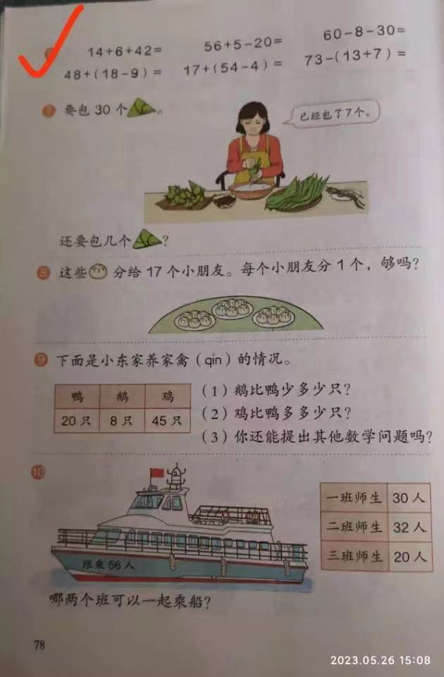  

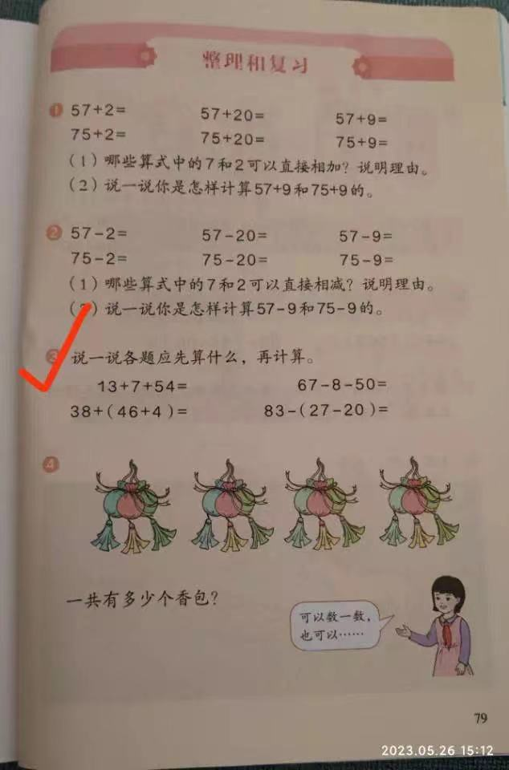  

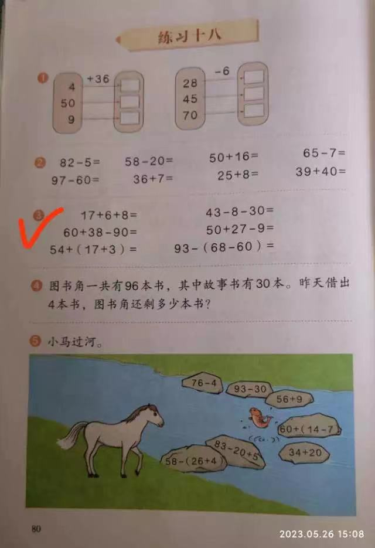  

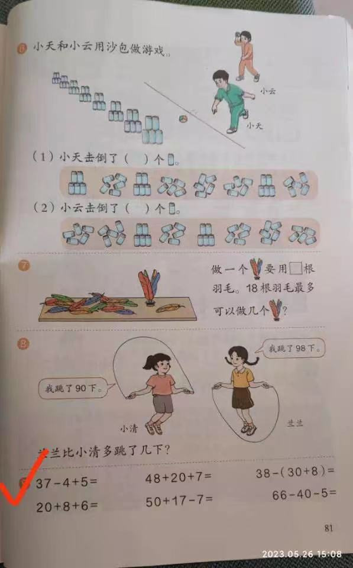  

## 语文期末试卷2

  

# 20230525

## 数学参考图1(两种方式)  

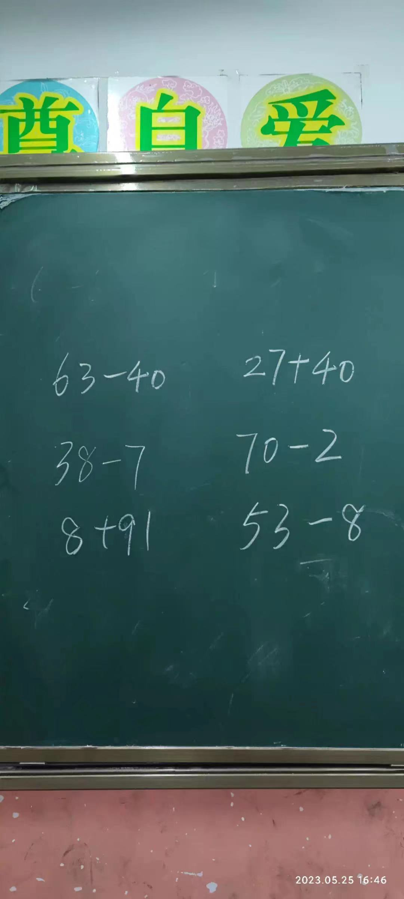  

# 20230522

## 数学参考图1(参考（图一）计算步骤，选一种自己喜欢的方法分步骤写下图（图二）计算题)  

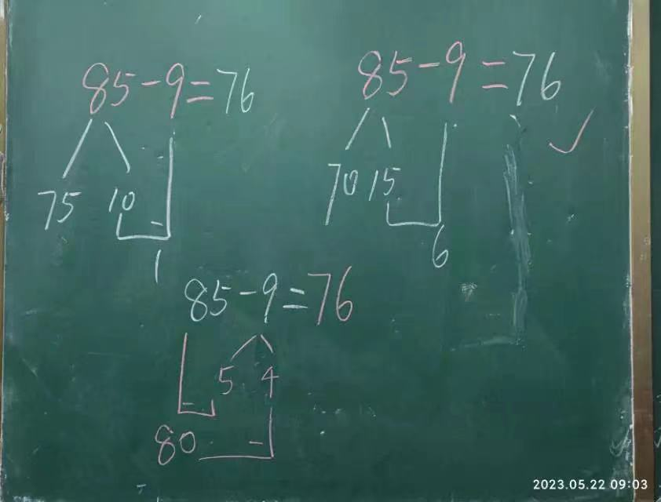  

## 数学参考图2(打钩题)

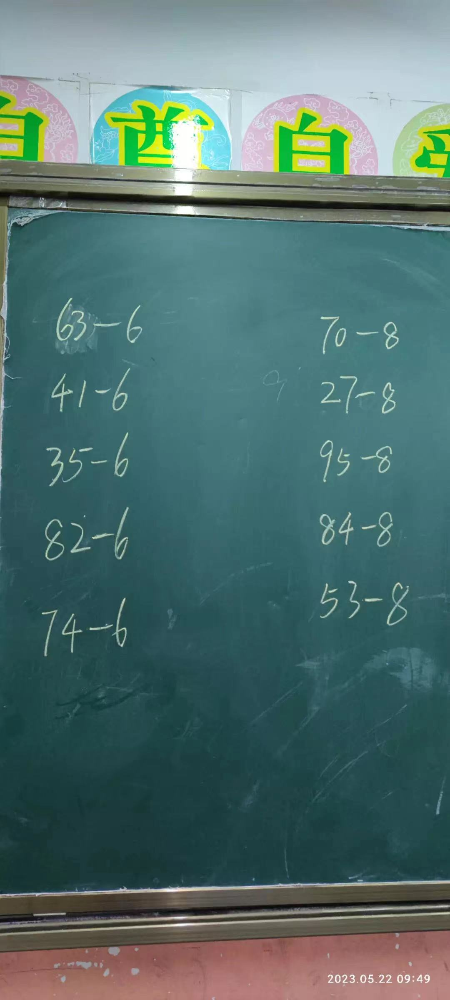  

## 语文期末试卷1

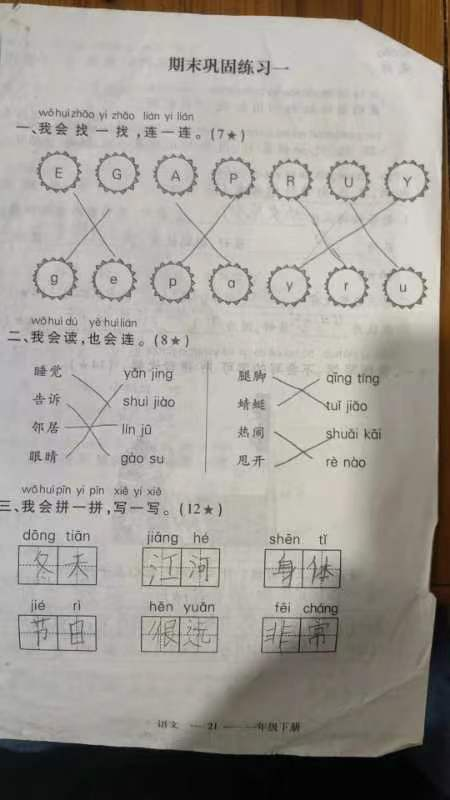  

# 20230517

## 语文看图写话1

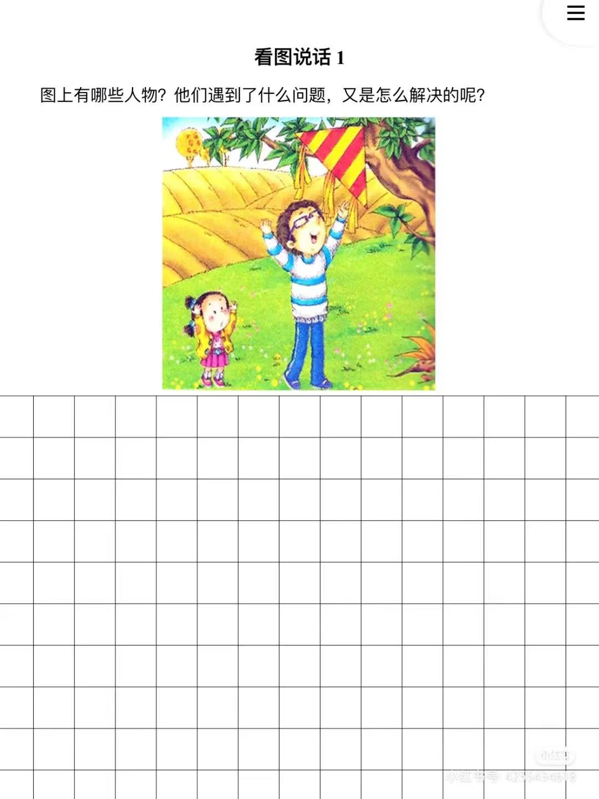  

# 20230516

## 语文看图写话1

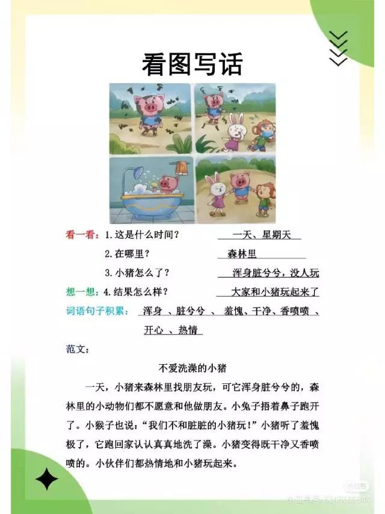  

# 20230515

## 数学参考图1(两种方式)  

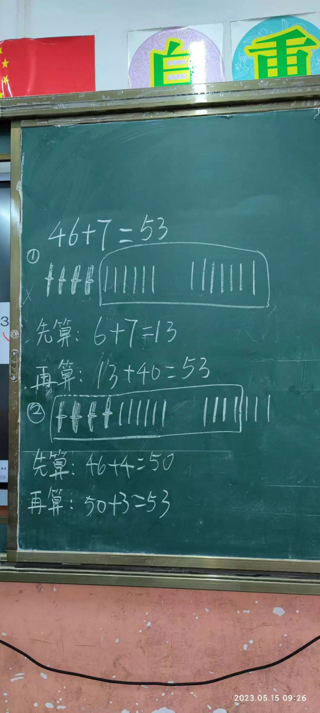  

## 数学参考图2(打钩题)

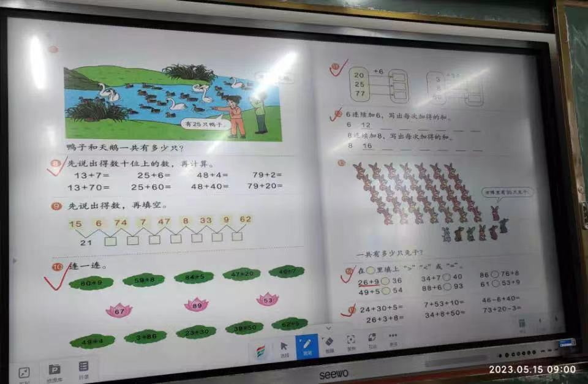  

# 20230513

## 语文看图写话1

  

## 语文看图写话2

  

# 20230505

## Test

  

  

