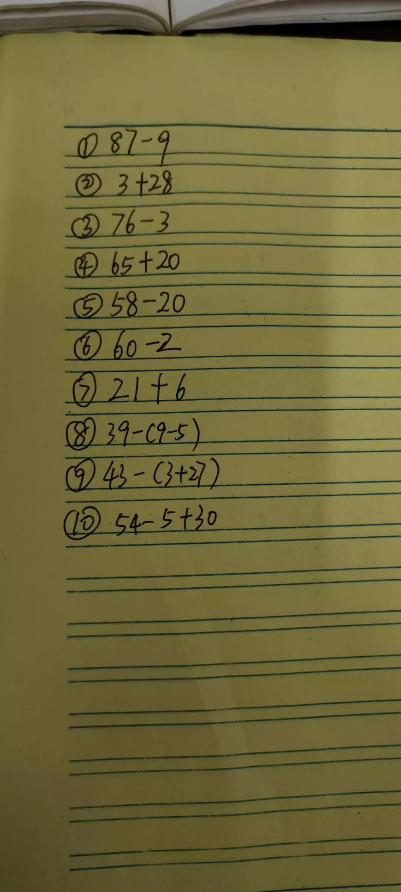
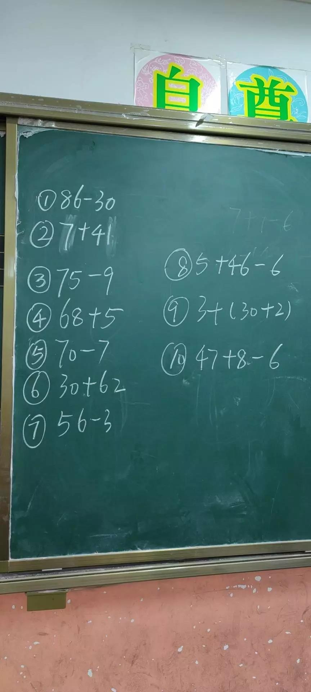
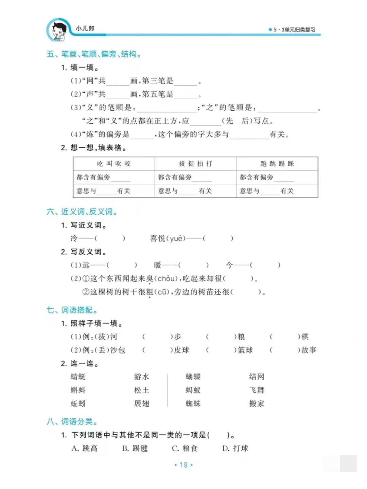
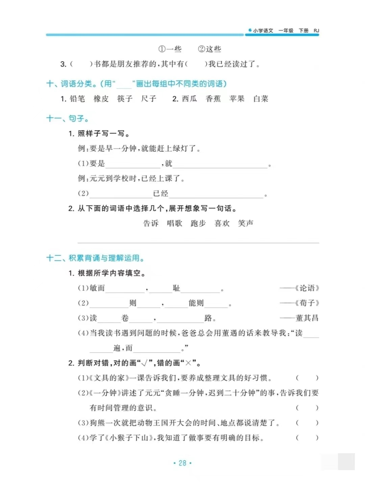
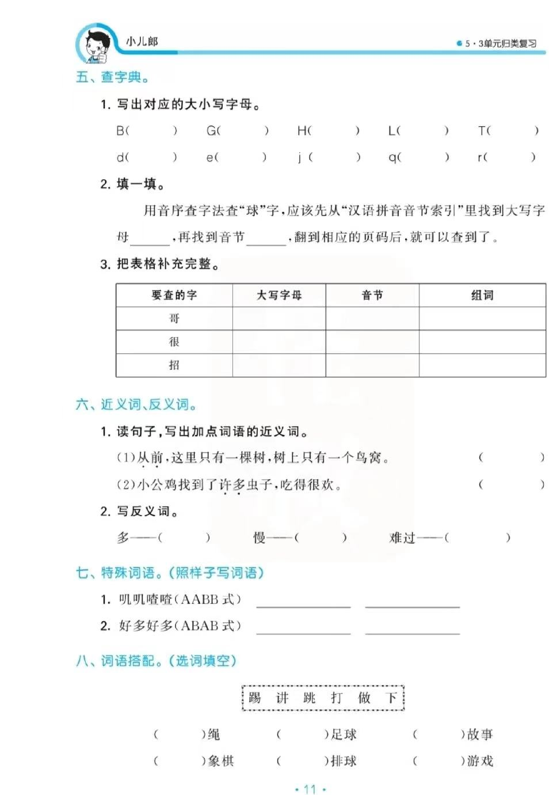
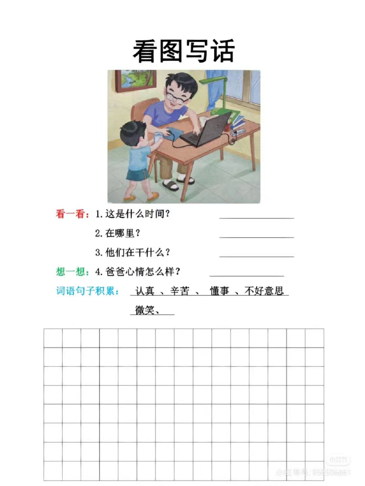

#   

## [@1年级上册看图写话](./hw/write1a.html)   

## [@1-2年级看图写话](./hw/write2a.html)   

## [@家庭作业](./hw/index.html)
## [@hwmd](./hw/homework.md)
## [@三字经](./hw/3rd.html) 
## [@11小](./hw/11小.html) 
## [@少先队队课(六知六会一做)](./hw/6s.html) 

# 20230616

## 数学参考图1(一号本) 

  

# 20230615

## 数学参考图1  

  

# 20230614

## 数学参考图1  

  

# 20230612

## 语文复习题1

###  语文复习题13A   
  

###  语文复习题13B   
  

###  语文复习题13C   
  

###  语文复习题14   
  

###  语文复习题15   
  

###  语文复习题16   
  

###  语文复习题17   
  

###  语文复习题18   
  

###  语文复习题19   
  

###  语文复习题20   
  

###  语文复习题21   
  

###  语文复习题22   
  

###  语文复习题23   
  

###  语文复习题24   
  

###  语文复习题25   
  

###  语文复习题26   
  

###  语文复习题27   
  

###  语文复习题28   
  

###  语文复习题29   
  

###  语文复习题30   
  

###  语文复习题31   
  

###  语文复习题32   
  

# 20230609

## 语文复习题1

  

  

  

  

# 20230607

## 语文复习题1

  

  

  

  

  

# 20230602

## 语文看图写话1

  

## 期末词语复习两页

 

  

# 20230526

## 数学参考图1(数学书P78-81)  

  

  

  

  

## 语文期末试卷2

  

# 20230525

## 数学参考图1(两种方式)  

  

# 20230522

## 数学参考图1(参考（图一）计算步骤，选一种自己喜欢的方法分步骤写下图（图二）计算题)  

  

## 数学参考图2(打钩题)

  

## 语文期末试卷1

  

# 20230517

## 语文看图写话1

  

# 20230516

## 语文看图写话1

  

# 20230515

## 数学参考图1(两种方式)  

  

## 数学参考图2(打钩题)

  

# 20230513

## 语文看图写话1

  

## 语文看图写话2

  

# 20230505

## Test

  

  

